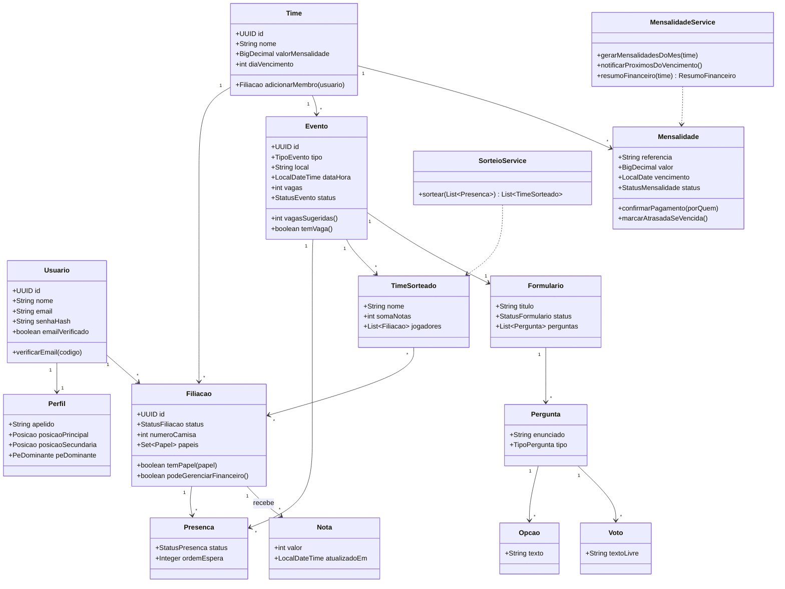

# Prorrogação — Documentação Técnica

App de gestão de times de futebol de várzea.
**Stack:** Java 21 + Spring Boot 3 · PostgreSQL · Angular + Ionic.

---

## 1. Visão geral do domínio

Um **usuário** cria uma conta (com verificação por e-mail), monta um **perfil de atleta** (posição, pé, camisa) e passa a fazer parte de um ou mais **times**. Quem cria o time é o **presidente**. Cada participação de um usuário em um time é uma **filiação (membership)**, e é nela que moram os **papéis** (presidente, tesoureiro, conselheiro, jogador).

O time organiza **eventos** (jogos), que podem ser **internos** (racha contra o próprio time) ou **externos** (contra time de fora). Os atletas **confirmam presença** respeitando o limite de **vagas**. Em jogos internos, o app **sorteia dois times balanceados** por posição e nota. Cada atleta tem uma **nota** dada pela cúpula (presidente/tesoureiro/conselheiros). Após o jogo, roda um **formulário de votação** (ex.: craque do jogo). O módulo **financeiro** gera **mensalidades**, controla pagamentos e notifica atrasados.

---

## 2. Papéis e permissões

Todos os papéis administrativos **também são jogadores**. Um membro pode acumular papéis (ex.: presidente que também é tesoureiro).

| Ação | Presidente | Tesoureiro | Conselheiro | Jogador |
|---|:---:|:---:|:---:|:---:|
| Criar / editar / excluir o time | ✅ | — | — | — |
| Convidar / remover membros | ✅ | — | — | — |
| Atribuir papéis a membros | ✅ | — | — | — |
| Criar / editar / cancelar eventos | ✅ | ✅ | ✅ | — |
| Confirmar a própria presença | ✅ | ✅ | ✅ | ✅ |
| Rodar o sorteio balanceado | ✅ | ✅ | ✅ | — |
| Dar nota aos atletas | ✅ | ✅ | ✅ | — |
| Ver as notas do elenco | ✅ | ✅ | ✅ | — |
| Criar formulário de votação do jogo | ✅ | ✅ | ✅ | — |
| Votar no formulário do jogo | ✅ | ✅ | ✅ | ✅ |
| Gerar mensalidades / definir valor e vencimento | ✅ | ✅ | — | — |
| Confirmar pagamento (marcar como pago) | ✅ | ✅ | — | — |
| Ver resumo financeiro do time | ✅ | ✅ | — | — |
| Ver a própria mensalidade | ✅ | ✅ | ✅ | ✅ |

> **Conselheiro** hoje: notas, sorteio, criação de formulários e criação de eventos. Ficou um espaço reservado (seção 4.4) para os acessos extras que você ainda vai definir — deixei o modelo pronto para receber novas permissões sem mudar o banco.

---

## 3. Regras de negócio por módulo

### 3.1 Autenticação e conta

1. Cadastro exige nome, e-mail único e senha (armazenada com **BCrypt**).
2. Ao cadastrar, gera-se um **código de 6 dígitos** enviado por e-mail, com validade de **15 minutos**.
3. A conta só faz login após o e-mail ser **verificado**. Login antes disso é bloqueado com mensagem clara.
4. O código pode ser **reenviado** após 60 s; um novo código invalida o anterior.
5. Autenticação via **JWT** (access token curto + refresh token). Senha guardada só como hash.

### 3.2 Perfil de atleta

1. Após verificar o e-mail e logar, o usuário cria o perfil: **apelido**, **posição principal** (obrigatória), posição secundária (opcional), **pé dominante** e número de camisa.
2. O número de camisa é único **por time**, não globalmente (resolvido na filiação).
3. Posições válidas: `GOLEIRO, ZAGUEIRO, LATERAL, VOLANTE, MEIA, ATACANTE`.

### 3.3 Time e filiações

1. Qualquer usuário pode **criar um time** e, ao criar, recebe automaticamente o papel `PRESIDENTE` + `JOGADOR`.
2. Entrar em um time gera uma **filiação** com status `PENDENTE`, `ATIVO` ou `INATIVO`.
3. Só o presidente atribui/revoga papéis. **Sempre deve existir exatamente um presidente**; para transferir, o presidente atual promove outro membro (transação atômica).
4. Um usuário pode pertencer a vários times; papéis são independentes por time.

### 3.4 Eventos (jogos)

1. Tipos: `INTERNO` (contra o próprio time) e `EXTERNO` (contra time de fora).
2. Ao criar, escolhe-se o tipo; o app **sugere o número de vagas**:
   - `INTERNO`: mais vagas (padrão **20**, o suficiente para 2 times) — o valor é editável.
   - `EXTERNO`: menos vagas (padrão **16** — titulares + banco) — editável.
3. Campos: título/adversário, local, data-hora, **prazo de confirmação**, vagas, status.
4. Ciclo de vida do evento:
   `AGENDADO → CONFIRMACOES_ABERTAS → (SORTEADO, só interno) → FINALIZADO`
   e `CANCELADO` a qualquer momento por quem tem permissão.

### 3.5 Presença e vagas

1. Cada membro registra presença: `CONFIRMADO`, `DUVIDA` ou `FORA`.
2. `CONFIRMADO` só é aceito enquanto **houver vaga** (`confirmados < vagas`). Ao lotar, novas confirmações entram em **lista de espera** (fila por ordem de chegada).
3. Se um confirmado muda para `FORA`, o **primeiro da espera** é promovido automaticamente e notificado.
4. Após o **prazo de confirmação**, a lista congela (mudanças só por quem administra).

### 3.6 Sorteio balanceado (só jogos internos)

Entra em cena quando o evento é `INTERNO` e as confirmações fecham. Objetivo: dois times **equilibrados por posição e por nota**.

**Entrada:** lista de confirmados, cada um com posição principal e **nota média** (seção 3.7).

**Algoritmo (draft “serpente” com equilíbrio de nota):**
1. Agrupar confirmados por posição.
2. Dentro de cada posição, ordenar por nota (desc).
3. Distribuir posição a posição, alternando o time que escolhe (1-2-2-1) e, a cada rodada, dando a próxima escolha ao time de **menor soma de notas** — isso mantém as posições distribuídas *e* a soma equilibrada.
4. Sobras ímpares vão para o time de menor soma.
5. Se a diferença de soma entre os times ficar acima de um limite (ex.: > 3), tenta-se **1 troca** de jogadores de mesma posição que reduza a diferença.

**Saída:** dois `MatchTeam` (Time A / Time B) com seus jogadores, soma e média de notas. O usuário pode **refazer** o sorteio (novo embaralhamento com o mesmo critério).

```
função sortearTimes(confirmados):
    porPosicao = agrupar(confirmados, p -> p.posicao)
    timeA = [], timeB = []
    para cada grupo em porPosicao (ordenado por nota desc):
        para cada jogador em grupo:
            destino = (soma(timeA) <= soma(timeB)) ? timeA : timeB
            destino.add(jogador)
    se |soma(timeA) - soma(timeB)| > LIMITE:
        tentarTrocaMesmaPosicao(timeA, timeB)
    retornar (timeA, timeB)
```

### 3.7 Notas dos atletas

1. Podem avaliar: **presidente, tesoureiro e conselheiros**. Um jogador comum **não** vê nem dá notas.
2. Cada avaliador dá **uma nota (1–10) por atleta**. A combinação (avaliador, avaliado) é única — reavaliar **atualiza** a nota.
3. A **nota do atleta** usada no sorteio é a **média** das notas recebidas (se não houver notas, usa um valor neutro configurável, ex.: 5).
4. As notas individuais dos avaliadores são privadas; o elenco só enxerga a média (opcional por configuração do time).

### 3.8 Formulário de votação do jogo

1. **Conselheiros** (e presidente/tesoureiro) **criam** o formulário de um evento e definem as **perguntas**.
2. Tipos de pergunta:
   - `JOGADOR`: opções são **os atletas do time** (ex.: “Craque do jogo”, “Pé-frio da rodada”).
   - `MULTIPLA`: opções de texto definidas por quem cria (ex.: “Nota da organização”).
   - `TEXTO`: resposta livre.
3. O formulário tem estados `RASCUNHO → ABERTO → FECHADO`, com janela de tempo (abre/fecha).
4. Cada membro vota **uma vez por pergunta** (par único pergunta+votante). Resultado é apurado por contagem; o app destaca o mais votado.

### 3.9 Mensalidades e financeiro

1. Presidente/tesoureiro definem o **valor padrão** da mensalidade e o **dia de vencimento**.
2. O sistema **gera mensalidades** para os atletas ativos a cada mês (job agendado), referência no formato `AAAA-MM`.
3. Status da mensalidade: `PENDENTE`, `PAGO`, `ATRASADO`, `ISENTO`.
4. Presidente/tesoureiro **confirmam o pagamento** (marcam como `PAGO`, registrando quem confirmou e quando).
5. Ao passar do **vencimento** sem pagamento, o status vira `ATRASADO` automaticamente (job diário).
6. **Conforme se aproxima o vencimento** (ex.: 3 dias antes) e no dia, quem está `PENDENTE` recebe **notificação**.
7. Resumo financeiro exibe: **arrecadado no mês**, **pendente no mês**, **acumulado no ano** e **caixa atual** do time.

### 3.10 Notificações

Geradas em: promoção da lista de espera, abertura de confirmações, sorteio publicado, formulário aberto, e cobrança de mensalidade próxima/vencida. Entregues in-app (e, opcionalmente, push via Ionic/Capacitor).

---

## 4. Modelo de dados (diagrama ER)

```mermaid
erDiagram
    USUARIO ||--|| PERFIL : tem
    USUARIO ||--o{ CODIGO_VERIFICACAO : recebe
    USUARIO ||--o{ FILIACAO : possui
    USUARIO ||--o{ NOTIFICACAO : recebe
    TIME ||--o{ FILIACAO : reune
    FILIACAO ||--o{ FILIACAO_PAPEL : tem
    TIME ||--o{ EVENTO : organiza
    EVENTO ||--o{ PRESENCA : registra
    FILIACAO ||--o{ PRESENCA : confirma
    EVENTO ||--o{ TIME_SORTEADO : gera
    TIME_SORTEADO ||--o{ TIME_SORTEADO_JOGADOR : contem
    FILIACAO ||--o{ TIME_SORTEADO_JOGADOR : escalado
    TIME ||--o{ NOTA : acumula
    FILIACAO ||--o{ NOTA : avaliado
    EVENTO ||--o{ FORMULARIO : possui
    FORMULARIO ||--o{ PERGUNTA : contem
    PERGUNTA ||--o{ OPCAO : oferece
    PERGUNTA ||--o{ VOTO : recebe
    FILIACAO ||--o{ VOTO : emite
    TIME ||--o{ MENSALIDADE : cobra
    FILIACAO ||--o{ MENSALIDADE : deve

    USUARIO {
        uuid id PK
        string nome
        string email UK
        string senha_hash
        boolean email_verificado
        timestamp criado_em
    }
    PERFIL {
        uuid usuario_id PK_FK
        string apelido
        string posicao_principal
        string posicao_secundaria
        string pe_dominante
        string foto_url
        date data_nascimento
    }
    CODIGO_VERIFICACAO {
        uuid id PK
        uuid usuario_id FK
        string codigo
        timestamp expira_em
        boolean usado
    }
    TIME {
        uuid id PK
        string nome
        string escudo_url
        string cidade
        decimal valor_mensalidade
        int dia_vencimento
        timestamp criado_em
    }
    FILIACAO {
        uuid id PK
        uuid time_id FK
        uuid usuario_id FK
        string status
        string apelido_no_time
        int numero_camisa
        timestamp entrou_em
    }
    FILIACAO_PAPEL {
        uuid filiacao_id FK
        string papel
    }
    EVENTO {
        uuid id PK
        uuid time_id FK
        string tipo
        string titulo
        string adversario
        string local
        timestamp data_hora
        int vagas
        timestamp prazo_confirmacao
        string status
        uuid criado_por FK
    }
    PRESENCA {
        uuid id PK
        uuid evento_id FK
        uuid filiacao_id FK
        string status
        int ordem_espera
        timestamp confirmado_em
    }
    TIME_SORTEADO {
        uuid id PK
        uuid evento_id FK
        string nome
        string cor
        int soma_notas
    }
    TIME_SORTEADO_JOGADOR {
        uuid time_sorteado_id FK
        uuid filiacao_id FK
    }
    NOTA {
        uuid id PK
        uuid time_id FK
        uuid avaliador_id FK
        uuid avaliado_id FK
        int nota
        timestamp atualizado_em
    }
    FORMULARIO {
        uuid id PK
        uuid evento_id FK
        string titulo
        string status
        timestamp abre_em
        timestamp fecha_em
        uuid criado_por FK
    }
    PERGUNTA {
        uuid id PK
        uuid formulario_id FK
        string enunciado
        string tipo
        int ordem
    }
    OPCAO {
        uuid id PK
        uuid pergunta_id FK
        uuid filiacao_id FK
        string texto
    }
    VOTO {
        uuid id PK
        uuid pergunta_id FK
        uuid votante_id FK
        uuid opcao_id FK
        string texto_livre
        timestamp criado_em
    }
    MENSALIDADE {
        uuid id PK
        uuid time_id FK
        uuid filiacao_id FK
        string referencia
        decimal valor
        date vencimento
        string status
        timestamp pago_em
        uuid confirmado_por FK
    }
    NOTIFICACAO {
        uuid id PK
        uuid usuario_id FK
        string tipo
        string titulo
        string corpo
        boolean lida
        timestamp criado_em
    }
```

**Índices e restrições que importam:**
- `USUARIO.email` único; `NOTA (avaliador_id, avaliado_id)` único; `VOTO (pergunta_id, votante_id)` único.
- `PRESENCA (evento_id, filiacao_id)` único; `FILIACAO (time_id, numero_camisa)` único.
- `MENSALIDADE (time_id, filiacao_id, referencia)` único.

---

## 5. Diagrama de classes (domínio)



**Enums:** `Papel {PRESIDENTE, TESOUREIRO, CONSELHEIRO, JOGADOR}` · `Posicao {GOLEIRO, ZAGUEIRO, LATERAL, VOLANTE, MEIA, ATACANTE}` · `PeDominante {DIREITO, ESQUERDO, AMBIDESTRO}` · `TipoEvento {INTERNO, EXTERNO}` · `StatusEvento {AGENDADO, CONFIRMACOES_ABERTAS, SORTEADO, FINALIZADO, CANCELADO}` · `StatusPresenca {CONFIRMADO, DUVIDA, FORA, ESPERA}` · `TipoPergunta {JOGADOR, MULTIPLA, TEXTO}` · `StatusFormulario {RASCUNHO, ABERTO, FECHADO}` · `StatusMensalidade {PENDENTE, PAGO, ATRASADO, ISENTO}`.

---

## 6. Arquitetura sugerida (Spring Boot)

Camadas: `controller` (REST) → `service` (regras de negócio) → `repository` (Spring Data JPA) → `domain` (entidades). Segurança com Spring Security + JWT; autorização por papel checada no `service` a partir da `Filiacao` do usuário no time do recurso.

```
com.prorrogacao
├── config          (security, jwt, cors, scheduling)
├── auth            (cadastro, login, verificação de e-mail)
├── usuario         (usuário + perfil)
├── time            (time, filiação, papéis)
├── evento          (evento, presença, vagas/espera)
├── sorteio         (SorteioService + resultado)
├── nota            (avaliação de atletas)
├── votacao         (formulário, pergunta, opção, voto)
├── financeiro      (mensalidade, resumo, jobs de cobrança)
└── notificacao
```

**Principais endpoints REST (rascunho):**

| Método | Rota | Papel mínimo |
|---|---|---|
| `POST` | `/auth/cadastro` | público |
| `POST` | `/auth/verificar-email` | público |
| `POST` | `/auth/login` | público |
| `PUT` | `/perfil` | autenticado |
| `POST` | `/times` | autenticado (vira presidente) |
| `POST` | `/times/{id}/membros` | presidente |
| `PATCH` | `/times/{id}/membros/{mid}/papeis` | presidente |
| `POST` | `/times/{id}/eventos` | conselheiro+ |
| `POST` | `/eventos/{id}/presenca` | jogador+ |
| `POST` | `/eventos/{id}/sorteio` | conselheiro+ |
| `PUT` | `/times/{id}/notas/{atletaId}` | conselheiro+ |
| `POST` | `/eventos/{id}/formulario` | conselheiro+ |
| `POST` | `/formularios/{id}/votos` | jogador+ |
| `POST` | `/times/{id}/mensalidades/gerar` | tesoureiro+ |
| `PATCH` | `/mensalidades/{id}/pagar` | tesoureiro+ |
| `GET` | `/times/{id}/financeiro/resumo` | tesoureiro+ |

**Jobs agendados (`@Scheduled`):** gerar mensalidades no início do mês; marcar atrasadas e notificar próximos do vencimento diariamente.

**Front (Angular + Ionic):** módulos espelhando o back (`auth`, `time`, `evento`, `sorteio`, `financeiro`), guards de rota por papel, e interceptor para anexar o JWT. Push nativo via Capacitor para as notificações de mensalidade e sorteio.

---

## 7. Pontos em aberto (para você decidir)

1. **Poderes extras do conselheiro** — o modelo de papéis por filiação já suporta adicionar permissões sem migração pesada; falta só definir quais (ex.: moderar elenco, aprovar entradas, gerir formulários de outros).
2. **Empate no sorteio** — definir o limite de diferença aceitável e quantas trocas o algoritmo tenta.
3. **Isenção de mensalidade** — quem pode marcar `ISENTO` e com qual justificativa.
4. **Múltiplos times por usuário** — confirmar se um atleta pode confirmar presença em jogos de times diferentes no mesmo horário (hoje: permitido, sem checagem de conflito).
```
